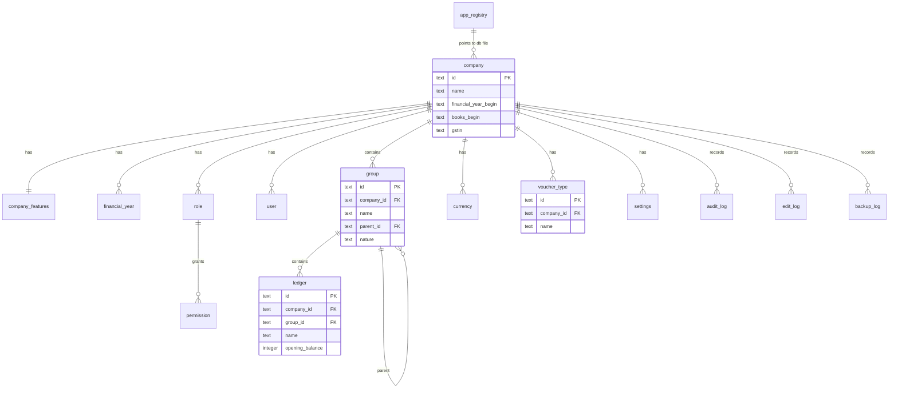

# Schema ER diagram (Phase 1 foundation)

```mermaid
erDiagram
  app_registry ||--o{ company : "points to db file"
  company ||--|| company_features : has
  company ||--o{ financial_year : has
  company ||--o{ role : has
  company ||--o{ user : has
  role ||--o{ permission : grants
  company ||--o{ group : contains
  group ||--o{ group : parent
  group ||--o{ ledger : contains
  company ||--o{ currency : has
  company ||--o{ voucher_type : has
  company ||--o{ settings : has
  company ||--o{ audit_log : records
  company ||--o{ edit_log : records
  company ||--o{ backup_log : records

  company {
    text id PK
    text name
    text financial_year_begin
    text books_begin
    text gstin
  }

  group {
    text id PK
    text company_id FK
    text name
    text parent_id FK
    text nature
  }

  ledger {
    text id PK
    text company_id FK
    text group_id FK
    text name
    integer opening_balance
  }

  voucher_type {
    text id PK
    text company_id FK
    text name
  }
```

Full voucher / inventory / payroll tables arrive in later migrations (Phases 2–6).
